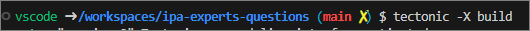

# Tectonic template for Visual Studio Code with a Dev Container

This is an opinionated template to give you a kick start into writing a LaTeX document with Tectonic and Visual Studio Code. It includes batteries:

- Preconfigured KOMAScript `scrreprt` document class
- Github Actions with [setup-tectonic](https://github.com/WtfJoke/setup-tectonic) action

## Getting started

 1. Clone this repository
 2. Open it in Visual Studio Code while having [Remote Containers](https://marketplace.visualstudio.com/items?itemName=ms-vscode-remote.remote-containers) installed and Docker running
 3. Click on left corner   "Open remote window"
 4. Open Folder in Container  wait until the container is running
 5. Go to the terminal 
 6. Type Tectonic command to build 
 7. See result in build/default folder 
 8. Click on left bottom corner   "Open remote window"
 9. Close remote connection 